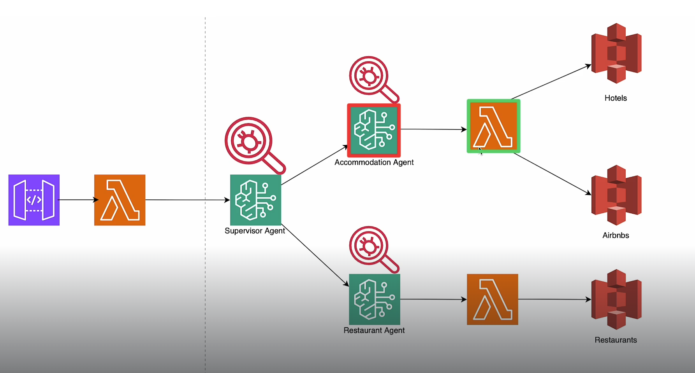

# BuildAIAgentsWithAWS

using API GW - lambda - Bedrock - S3

## Setting Up AWS

- sign in to console using root user email.Now let's create IAM User(multi-agentic-user-role).
  - You will attach administrator policy and allows for changeUserPass setting - download csv and login with user account and update pass.

## Architecture Design, Model Access and Quotas

